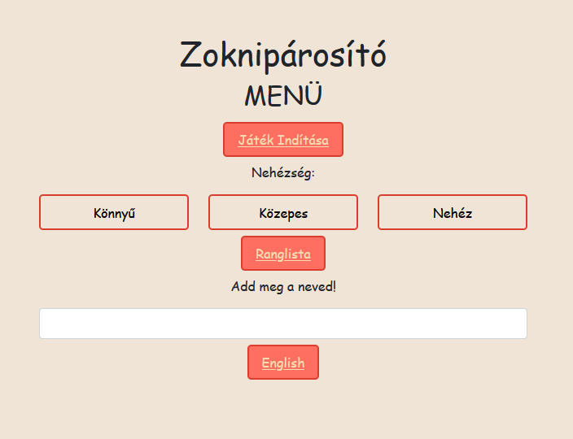
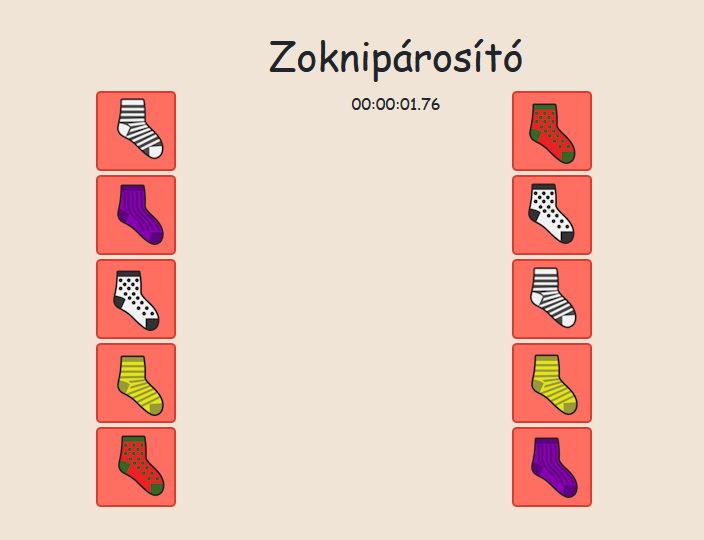
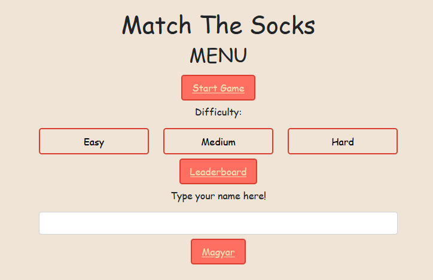
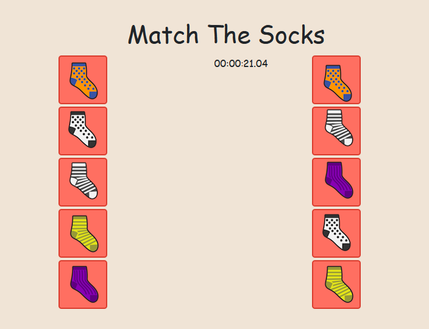
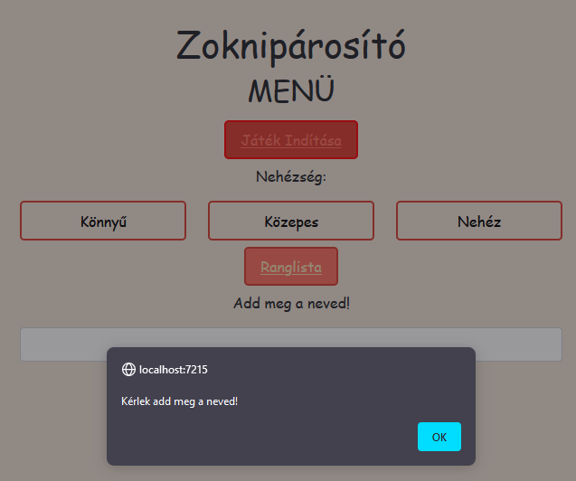
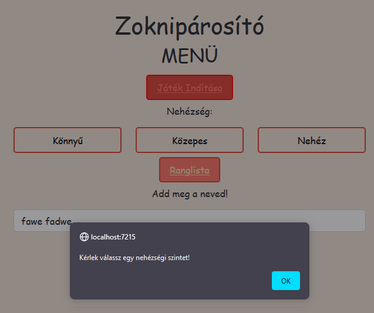

Az alábbiakban talál egy példa szoftvertesztelési jegyzőkönyv mintájára. Ezt a jegyzőkönyvet egy képzeletbeli webalkalmazás tesztelésére használjuk.

# Szoftvertesztelési Jegyzőkönyv

## Projekt információk

- Projekt neve: Webalkalmazás Tesztelése
- Tesztelő neve: Bokor Alber
- Tesztelés dátuma: 2023.09.24

## Tesztelendő Rendszer

- Rendszer neve: Zoknipárosító
- Rendszer verziója: 1

## Tesztesetek

### Teszt #1: Oldalak megjelenése különböző ablakméreteken

#### Teszt Rövid Leírása
Főmenü, Játék és Ranglista oldal megjelenése különböző ablakméreteken 

#### Tesztesetek

#### 1. Főmenü, Firefox 117.0.1 desktop, fullscreen 1920x1080px
**Eredmény:** oldal kivánt módon jelenik meg ✅

#### 2. Főmenü, Firefox 117.0.1 desktop, emulált iPad 810x1080px
Eredmény: oldal kivánt módon jelenik meg ✅

#### 3. Főmenü, Firefox 117.0.1 desktop, emulált Galaxy Note 412x915px
Eredmény: a cimkék kicsit kezdenenk lecsúszni a gombokról be még minden olvasható és klikkelhető✅

#### 4. Főmenü, Google Chrome 116.0.5845.188 desktop, fullscreen 1920x1080px
**Eredmény:** oldal kivánt módon jelenik meg ✅

#### 5. Főmenü, Google Chrome 116.0.5845.188 desktop, emulált iPad 820x1180px
**Eredmény:** oldal kivánt módon jelenik meg ✅

#### 6. Főmenü, Google Chrome 116.0.5845.188 desktop, emulált Galaxy Note 393x851px
**Eredmény:** a cimkék kicsit kezdenenk lecsúszni a gombokról be még minden olvasható és klikkelhető✅

#### 7. Főmenü, Edge 117.0.2045.41 desktop, fullscreen 1920x1080px
**Eredmény:** oldal kivánt módon jelenik meg ✅

#### 8. Játék, Firefox 117.0.1 desktop, fullscreen 1920x1080px
**Eredmény:** oldal kivánt módon jelenik meg ✅

#### 9. Játék, Firefox 117.0.1 desktop, emulált iPad 810x1080px
**Eredmény:** oldal kivánt módon jelenik meg ✅

#### 10. Játék, Firefox 117.0.1 desktop, emulált Galaxy Note 412x915px
**Eredmény**: a zokni ikonok kicsit le vannak vágva de teljesen felismerhetőek és klikkelhetőek ✅

#### 11. Játék, Google Chrome 116.0.5845.188 desktop, fullscreen 1920x1080px
**Eredmény:** oldal kivánt módon jelenik meg ✅

#### 12. Játék, Google Chrome 116.0.5845.188 desktop, emulált iPad 820x1180px
**Eredmény:** oldal kivánt módon jelenik meg ✅

#### 13. Játék, Google Chrome 116.0.5845.188 desktop, emulált Galaxy Note 393x851px
**Eredmény:** a zokni ikonok kicsit le vannak vágva de teljesen felismerhetőek és klikkelhetőek ✅

#### 14. Játék, Edge 117.0.2045.41 desktop, fullscreen 1920x1080px
**Eredmény:** oldal kivánt módon jelenik meg ✅

#### 15. Ranglista, Firefox 117.0.1 desktop, fullscreen 1920x1080px
**Eredmény:** oldal kivánt módon jelenik meg ✅

#### 16. Ranglista, Firefox 117.0.1 desktop, emulált iPad 810x1080px
**Eredmény:** oldal kivánt módon jelenik meg ✅

#### 17. Ranglista, Firefox 117.0.1 desktop, emulált Galaxy Note 412x915px
**Eredmény:** oldal kivánt módon jelenik meg ✅

#### 18. Ranglista, Google Chrome 116.0.5845.188 desktop, fullscreen 1920x1080px
**Eredmény:** oldal kivánt módon jelenik meg ✅

#### 19. Ranglista, Google Chrome 116.0.5845.188 desktop, emulált iPad 820x1180px
**Eredmény:** oldal kivánt módon jelenik meg ✅

#### 20. Ranglista, Google Chrome 116.0.5845.188 desktop, emulált Galaxy Note 393x851px
**Eredmény:** oldal kivánt módon jelenik meg ✅

#### 21. Ranglista, Edge 117.0.2045.41 desktop, fullscreen 1920x1080px
**Eredmény:** oldal kivánt módon jelenik meg ✅

#### Teszt állapota: Sikeres

### Teszt #2: Oldal nyelv váltás

#### Teszt Rövid Leírása
Főmenü, Játék és Ranglista oldal nyelvének megjelenése angol és magyar nyelven 

#### Tesztesetek

#### 1. Főmenü, magyar, Firefox 117.0.1 desktop
**Eredmény:** feliratok mefelelően kiiródnak, nyelv váltó gomb működik ✅
#### 2. Főmenü, magyar, Chrome 116.0.5845.188 desktop
**Eredmény:** feliratok mefelelően kiiródnak, nyelv váltó gomb működik ✅
#### 3. Főmenü, magyar, Edge 117.0.2045.41 desktop
**Eredmény:** feliratok mefelelően kiiródnak, nyelv váltó gomb működik ✅

#### 4. Főmenü, angol, Firefox 117.0.1 desktop
**Eredmény:** feliratok mefelelően kiiródnak, nyelv váltó gomb működik ✅
#### 5. Főmenü, angol, Chrome 116.0.5845.188 desktop
**Eredmény:** feliratok mefelelően kiiródnak, nyelv váltó gomb működik ✅
#### 6. Főmenü, angol, Edge 117.0.2045.41 desktop
**Eredmény:** feliratok mefelelően kiiródnak, nyelv váltó gomb működik ✅

#### 7. Játék, magyar, Firefox 117.0.1 desktop
**Eredmény:** feliratok mefelelően kiiródnak ✅
#### 8. Játék, magyar, Chrome 116.0.5845.188 desktop
**Eredmény:** feliratok mefelelően kiiródnak ✅
#### 9. Játék, magyar, Edge 117.0.2045.41 desktop
**Eredmény:** feliratok mefelelően kiiródnak ✅

#### 10. Játék, angol, Firefox 117.0.1 desktop
**Eredmény:** feliratok mefelelően kiiródnak ✅
#### 11. Játék, angol, Chrome 116.0.5845.188 desktop
**Eredmény:** feliratok mefelelően kiiródnak ✅
#### 12. Játék, angol, Edge 117.0.2045.41 desktop
**Eredmény:** feliratok mefelelően kiiródnak ✅

#### 13. Ranglista, magyar, Firefox 117.0.1 desktop
**Eredmény:** feliratok mefelelően kiiródnak ✅
#### 14. Ranglista, magyar, Chrome 116.0.5845.188 desktop
**Eredmény:** feliratok mefelelően kiiródnak ✅
#### 15. Ranglista, magyar, Edge 117.0.2045.41 desktop
**Eredmény:** feliratok mefelelően kiiródnak ✅

#### 16. Ranglista, angol, Firefox 117.0.1 desktop
**Eredmény:** feliratok mefelelően kiiródnak ✅
#### 17. Ranglista, angol, Chrome 116.0.5845.188 desktop
**Eredmény:** feliratok mefelelően kiiródnak ✅
#### 18. Ranglista, angol, Edge 117.0.2045.41 desktop
**Eredmény:** feliratok mefelelően kiiródnak ✅

#### Teszt állapota: Sikeres

### Teszt #3: Játék inditása

#### Teszt Rövid Leírása
Főmenüből megpróbáljuk elinditani a játékot 

#### Tesztesetek

#### 1. üres mezőkkel, Firefox 117.0.1 desktop
**Eredmény:** popup-ot dob `Kérlek add meg a neved!` felirattal ✅
#### 2. üres mezőkkel, Chrome 116.0.5845.188 desktop
**Eredmény:** popup-ot dob `Kérlek add meg a neved!` felirattal ✅
#### 3. üres mezőkkel, Edge 117.0.2045.41 desktop
**Eredmény:** popup-ot dob `Kérlek add meg a neved!` felirattal ✅

#### 4. név megadva, Firefox 117.0.1 desktop
**Eredmény:** popup-ot dob `Kérlek válassz egy nehézségi szintet!` felirattal ✅
#### 5. név megadva, Chrome 116.0.5845.188 desktop
**Eredmény:** popup-ot dob `Kérlek válassz egy nehézségi szintet!` felirattal ✅
#### 6. név megadva, Edge 117.0.2045.41 desktop
**Eredmény:** popup-ot dob `Kérlek válassz egy nehézségi szintet!` felirattal ✅

#### 7. nehézségi fokozat megadva, Firefox 117.0.1 desktop
**Eredmény:** popup-ot dob `Kérlek add meg a neved!` felirattal ✅
#### 8. nehézségi fokozat megadva, Chrome 116.0.5845.188 desktop
**Eredmény:** popup-ot dob `Kérlek add meg a neved!` felirattal ✅
#### 9. nehézségi fokozat megadva, Edge 117.0.2045.41 desktop
**Eredmény:** popup-ot dob `Kérlek add meg a neved!` felirattal ✅

#### 10. név és nehézségi fokozat megadva, Firefox 117.0.1 desktop
**Eredmény:** játék elindul ✅
#### 11. név és nehézségi fokozat megadva, Chrome 116.0.5845.188 desktop
**Eredmény:** játék elindul ✅
#### 12. név és nehézségi fokozat megadva, Edge 117.0.2045.41 desktop
**Eredmény:** játék elindul ✅

### Teszt #4: Többszörös kijelölés

#### Teszt Rövid Leírása
Főmenüből megpróbáljuk elinditani a játékot 

#### Tesztesetek

#### Eredmények
A játék csak abban az esetben indul el ha előtte megadtuk a nevet és a nehézségi fokozatot is

#### Teszt állapota: Sikeres

### Teszt #4: Játék inditása

## Tesztek Összegzése

## Képek és Hibajelentések

(A képernyőképek vagy hibajelentések itt helyezhetők el szükség esetén.)

## Aláírás

Tesztelő neve: [Tesztelő neve]

Dátum: [Dátum]

---
