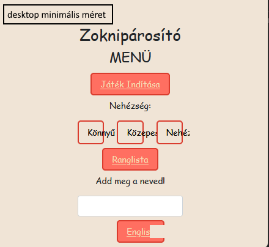
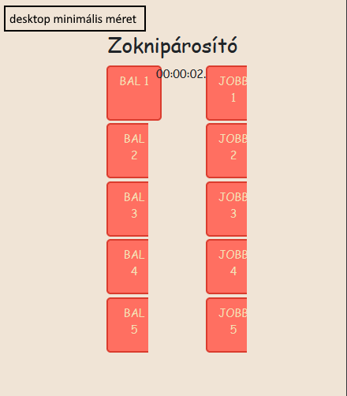

Az alábbiakban talál egy példa szoftvertesztelési jegyzőkönyv mintájára. Ezt a jegyzőkönyvet egy képzeletbeli webalkalmazás tesztelésére használjuk.

# Szoftvertesztelési Jegyzőkönyv

## Projekt információk

- Projekt neve: Webalkalmazás Tesztelése
- Tesztelő neve: Bokor Alber
- Tesztelés dátuma: 2023.09.24

## Tesztelendő Rendszer

- Rendszer neve: Zoknipárosító
- Rendszer verziója: 1

## Tesztesetek

### Teszt #1: Oldalak megjelenése különböző ablakméreteken

#### Teszt Rövid Leírása
Főmenü, Játék és Ranglista oldal megjelenése különböző ablakméreteken 

#### Tesztesetek
(A)--Főmenü
(B)--Játék
(C)--Ranglista
1. Firefox desktpo
2. Firefox mobile
3. Chrome desktop
4. Chrome mobile
5. Edge desktop

#### Eredmények
- desktop nézeteken 440px minimális szélesség, mobil nézetben kisebb is elérhető de úgy már kezdenek egymásba lógni a gombok
- a böngészők kőzül egyikben sem tért el látványosan az oldalak megjelenése

#### Teszt állapota: Sikeres

## Tesztek Összegzése

## Képek és Hibajelentések

(A képernyőképek vagy hibajelentések itt helyezhetők el szükség esetén.)

## Aláírás

Tesztelő neve: [Tesztelő neve]

Dátum: [Dátum]

---
