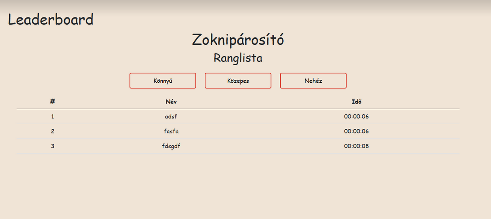

Az alábbiakban talál egy példa szoftvertesztelési jegyzőkönyv mintájára. Ezt a jegyzőkönyvet egy képzeletbeli webalkalmazás tesztelésére használjuk.

# Szoftvertesztelési Jegyzőkönyv

## Projekt információk

- Projekt neve: Webalkalmazás Tesztelése
- Tesztelő neve: Bokor Alber
- Tesztelés dátuma: 2023.09.24

## Tesztelendő Rendszer

- Rendszer neve: Zoknipárosító
- Rendszer verziója: 1

## Tesztesetek

### Teszt #1: Oldalak megjelenése különböző ablakméreteken

#### Teszt Rövid Leírása
Főmenü, Játék és Ranglista oldal megjelenése különböző ablakméreteken 

#### Tesztesetek

1. Főmenü, Firefox desktpo
2. Főmenü, Firefox mobile
3. Főmenü, Chrome desktop
4. Főmenü, Chrome mobile
5. Főmenü, Edge desktop
6. Játék, Firefox desktpo
7. Játék, Firefox mobile
8. Játék, Chrome desktop
9. Játék, Chrome mobile
10. Játék, Edge desktop
11. Ranglista, Firefox desktpo
12. Ranglista, Firefox mobile
13. Ranglista, Chrome desktop
14. Ranglista, Chrome mobile
15. Ranglista, Edge desktop

#### Eredmények
- desktop nézeteken 440px minimális szélesség, mobil nézetben kisebb is elérhető, de ezen a méreten már kezdenek egymásba lógni a feliratok
- a böngészők kőzül egyikben sem tért el látványosan az oldalak megjelenése

#### Teszt állapota: Sikeres

## Tesztek Összegzése

## Képek és Hibajelentések

(A képernyőképek vagy hibajelentések itt helyezhetők el szükség esetén.)

## Aláírás

Tesztelő neve: [Tesztelő neve]

Dátum: [Dátum]

---
